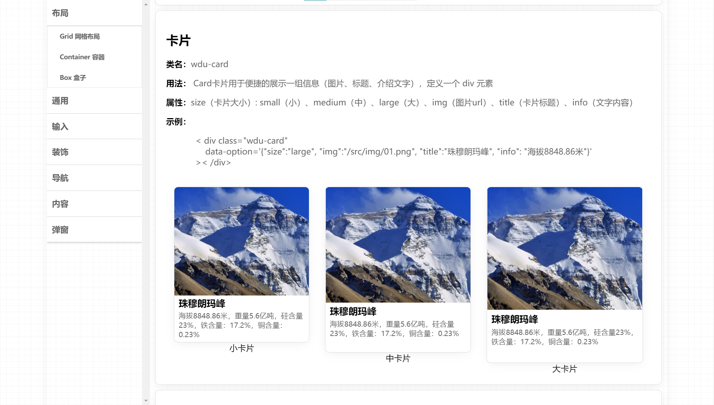

# 介绍

- 这是一个用原生 Javascript 编写的拟物化风格的轻量级 UI 组件库
- 使用 Webpack 来执行项目的打包构建，使用 ES6 来编写主要逻辑，使用了 Less 来编写样式

# 说明
本项目为个人学习基础Javascript技术的实践

# 预览

[在线预览](https://undefine4080.github.io/Wood-UI/)

# 组件

+ Button 按钮
+ Card 卡片
+ Carousel 轮播
+ CheckBox 复选按钮
+ Input 输入框
+ Mark 标记
+ Switch 开关
+ Collapse 折叠面板
+ Nav 导航菜单
+ Tab 选项卡
+ Radio 单选按钮  
+ Paper 壁纸
+ Message 消息弹窗
+ Select 下拉选择
+ Textarea 文本域
+ Form 表单

# 运行
+ 开发环境打包 `npm run dev`
 + 开发环境运行`npm run serve`
 + 生产环境打包`npm run build`

# 使用
引入dist 目录中的 woodui.css 文件和 woodui.js文件

# 持续开发中...
